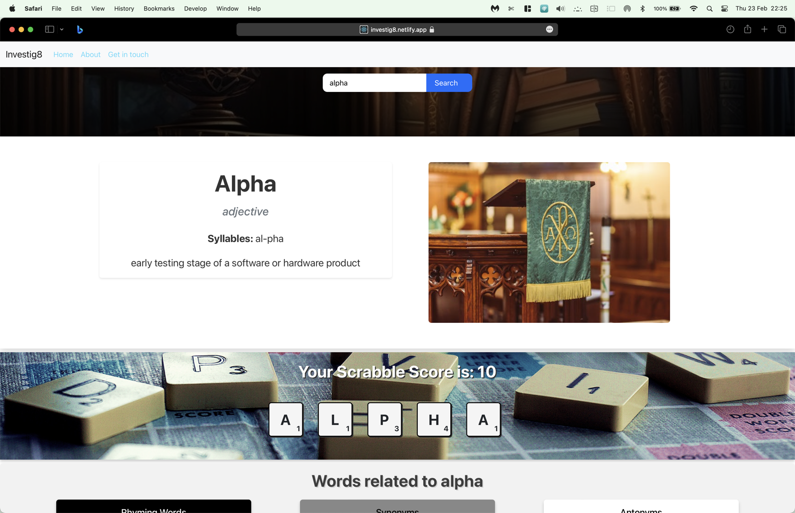

# Investig8

## Description

## Deployment

https://dash-alpha.netlify.app

## Screenshot

<!--  -->

## Usage

## User stories

### Traveller
Sara recently moved to the UK from Australia and is having trouble understanding local slang: when someone says "chill," she doesn't know what it means. She tries to search for the word on Google but the results she gets are confusing. She needs a tool that will help her understand what "chill" means in the context of British English slang.

### Tutor
Ali is tutoring his cousin in English at school. She recently moved to the UK from Iran and is having trouble understanding some of the words she hears in class. When they try to search for the word "remarkable" on Google, they find images of tablets instead of the definition of the word. Ali needs a tool that will help his cousin quickly and easily find the definitions of English words, without confusing or irrelevant results.

### For local development:

- run `npm i` to install dependencies

- `npm start` runs the app in development mode.
  Open [http://localhost:3000](http://localhost:3000)

## Testing

`npm test` launches tests

## Reporting issues

### Suggesting features, improvements, bug fixes

https://github.com/stevelab1/dev-portfolio/issues

## Credits

- Meta
- Trilogy

## License

Pending
